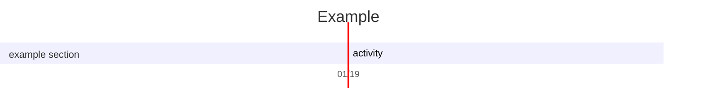
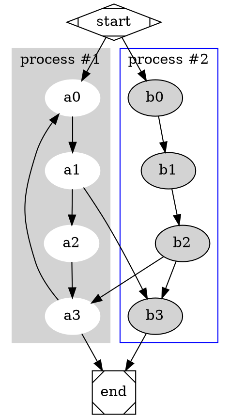

# test h1
## test h2
### test h3
#### test h4
##### test h5
###### test h6

> Parting line

---

> table

| Column1        |    Column2     |        Column3 |
| :------------- | :------------: | -------------: |
| Item1          |     Item1      |          Item1 |


> codeblock

```cpp
#include <iostream>
using namespace std;

int main (int argc, char** argv) {
  printf ("hello world");
  return 0;
}
```


> iamge

 

> list

- [x] 学习rust
  - [ ] list4 
  - asdf
1. asdf
  2. asdf


$$
\sqrt[{3}]{
  -\frac{q}{2}
  +\sqrt{\frac{q^2}{4} + {\frac{p^{3}}{27}}}
}+
\sqrt[{3}]{
  -\frac{q}{2}
  -\sqrt{\frac{q^2}{4} + {\frac{p^{3}}{27}}}
}
$$


@startuml
Bob -> Alice : hello
@enduml


$\sqrt{3x-1}+(1+x)^2$

$$\begin{array}{c}

\nabla \times \vec{\mathbf{B}} -\, \frac1c\, \frac{\partial\vec{\mathbf{E}}}{\partial t} &
= \frac{4\pi}{c}\vec{\mathbf{j}}    \nabla \cdot \vec{\mathbf{E}} & = 4 \pi \rho \\

\nabla \times \vec{\mathbf{E}}\, +\, \frac1c\, \frac{\partial\vec{\mathbf{B}}}{\partial t} & = \vec{\mathbf{0}} \\

\nabla \cdot \vec{\mathbf{B}} & = 0

\end{array}$$



``` flowchart
st=>start: Start|past:>http://www.google.com[blank]
e=>end: End|future:>http://www.google.com
op1=>operation: My Operation|past
op2=>operation: Stuff|current
sub1=>subroutine: My Subroutine|invalid
cond=>condition: Yes
or No?|approved:>http://www.google.com
c2=>condition: Good idea|rejected
io=>inputoutput: catch something...|future

st->op1(right)->cond
cond(yes, right)->c2
cond(no)->sub1(left)->op1
c2(yes)->io->e
c2(no)->op2->e
```


